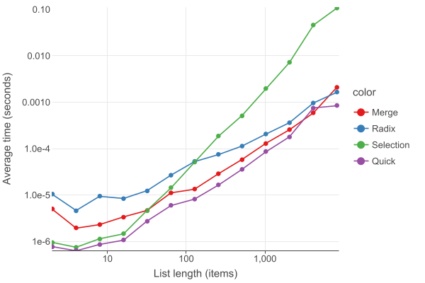

# Assignment 4

This is the project for [Assignment 4 of DSA](https://olindsa2024.github.io/assignments/assignment_04).

## Complexity Analysis

### Quick Sort
Quick sort has time complexity $\Theta$

### Merge Sort

### Selection Sort

### Radix Sort

## Benchmarking
Here are the results of benchmarking the sorting algorithms

The lists the sorting algorithms were tested on had lengths that were powers of two, ranging from $2^{1}$ to $2^{13}$. 
They contained random integers ranging from 0 to 9999. Each sorting algorithm was tested on each length of list 1000
times.

These results make sense with the time complexities that we determined earlier. It also makes sense that quick sort is 
the most widely used sorting algorithm out of the ones I implemented, because it is consistently the fastest, both with
small lists and large ones. I was surprised by how well radix sort performed, and with very large datasets that have
a small range of numbers, I could see it being very useful. In pretty much any other application, though, I would just
go with quick sort.